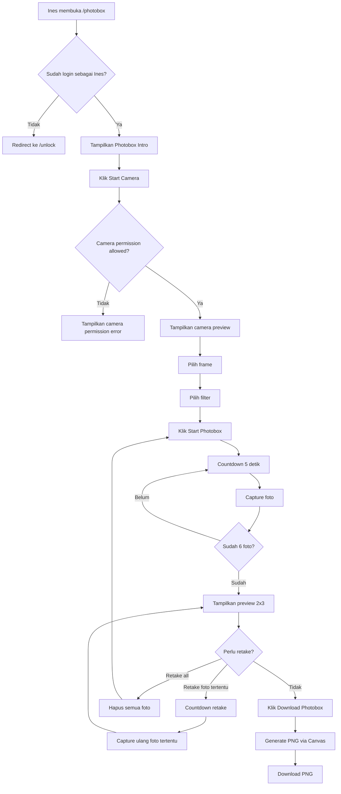
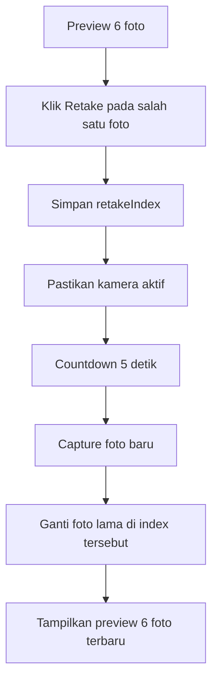
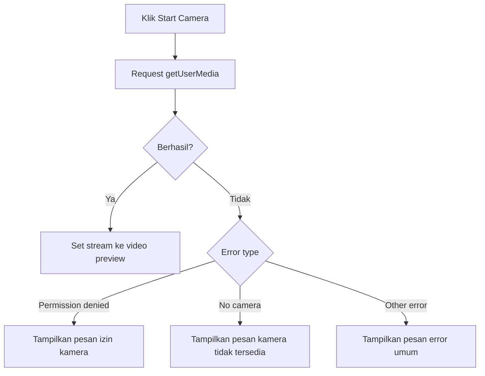

# Photobox User Flow

## 1. Tujuan User Flow

Dokumen ini menjelaskan alur penggunaan fitur Photobox dari sudut pandang Ines.

Photobox harus terasa sederhana:

```text
Buka Photobox
Start Camera
Pilih frame dan filter
Start Photobox
Ambil 6 foto otomatis
Preview
Retake jika perlu
Download PNG
```

## 2. Actor

```text
Actor utama: Ines
Role: ines
Route: /photobox
```

Admin tidak memiliki flow Photobox pada MVP awal.

## 3. Entry Flow

### 3.1 Masuk dari Navigasi Ines

```text
Ines login
↓
Masuk /home
↓
Klik menu Photobox
↓
Masuk /photobox
```

### 3.2 Masuk Langsung dari URL

```text
Ines membuka /photobox
↓
Sistem cek login dan role
↓
Jika belum login → redirect /unlock
↓
Jika role ines → tampilkan Photobox
↓
Jika role admin → redirect /admin
```

## 4. Main Flow

```text
Ines membuka /photobox
↓
Website menampilkan intro Photobox
↓
Ines klik Start Camera
↓
Browser meminta izin kamera
↓
Jika izin diberikan, preview kamera tampil
↓
Ines memilih frame
↓
Ines memilih filter
↓
Ines klik Start Photobox
↓
Countdown 5 detik
↓
Capture foto 1
↓
Countdown 5 detik
↓
Capture foto 2
↓
Countdown 5 detik
↓
Capture foto 3
↓
Countdown 5 detik
↓
Capture foto 4
↓
Countdown 5 detik
↓
Capture foto 5
↓
Countdown 5 detik
↓
Capture foto 6
↓
Tampilkan preview 6 foto
↓
Ines bisa retake foto tertentu atau retake all
↓
Ines klik Download Photobox
↓
Sistem generate PNG
↓
File PNG terdownload
```

## 5. Permission Flow

### 5.1 Permission Diberikan

```text
Klik Start Camera
↓
Browser menampilkan permission dialog
↓
Ines klik Allow
↓
Video preview tampil
```

### 5.2 Permission Ditolak

```text
Klik Start Camera
↓
Browser menampilkan permission dialog
↓
Ines klik Block
↓
Website menampilkan pesan:
"I need your camera permission to make this little memory.
Please allow camera access, sayang."
```

### 5.3 Kamera Tidak Tersedia

```text
Klik Start Camera
↓
getUserMedia gagal karena device/browser tidak punya kamera
↓
Website menampilkan pesan:
"Your camera is not available right now.
Try again from another device or browser."
```

## 6. Frame Selection Flow

```text
Camera preview sudah tampil
↓
Ines melihat 5 pilihan frame
↓
Ines memilih salah satu frame
↓
Frame aktif ditandai dengan soft active state
↓
Frame digunakan di preview dan hasil PNG final
```

Frame:

1. Cream Scrapbook
2. Dusty Rose Love
3. Vintage Paper
4. Golden Memory
5. Playful Notes

## 7. Filter Selection Flow

```text
Camera preview sudah tampil
↓
Ines melihat 5 pilihan filter
↓
Ines memilih salah satu filter
↓
Filter langsung terlihat di preview kamera
↓
Filter juga diterapkan ke hasil final
```

Filter:

1. Normal
2. Warm
3. Soft Pink
4. Vintage
5. Black & White

## 8. Auto Capture Flow

```text
Ines klik Start Photobox
↓
Button capture disabled
↓
Countdown 5
↓
Countdown 4
↓
Countdown 3
↓
Countdown 2
↓
Countdown 1
↓
Text "Smile, sayang!"
↓
Capture foto
↓
Simpan foto ke capturedPhotos
↓
Lanjut foto berikutnya sampai 6 foto
```

Aturan:

```text
Selama capture otomatis berjalan:
- tombol Start Photobox disabled
- tombol frame/filter boleh disabled agar hasil konsisten
- tombol Retake belum muncul
- countdown overlay harus jelas
```

## 9. Preview Flow

```text
6 foto selesai
↓
Website menampilkan preview 2 kolom x 3 baris
↓
Setiap foto memiliki tombol Retake
↓
Tersedia tombol Retake All
↓
Tersedia tombol Download Photobox
```

## 10. Retake Foto Tertentu Flow

```text
Ines klik Retake pada foto tertentu
↓
Sistem menyimpan index foto yang akan diganti
↓
Kamera aktif jika belum aktif
↓
Countdown 5 detik
↓
Capture ulang satu foto
↓
Foto lama diganti dengan foto baru
↓
Preview 6 foto tampil lagi
```

Contoh:

```text
Ines klik Retake foto ke-4
↓
Countdown
↓
Capture ulang foto ke-4
↓
Hanya foto ke-4 berubah
```

## 11. Retake All Flow

```text
Ines klik Retake All
↓
Sistem menghapus semua capturedPhotos
↓
Kembali ke mode camera preview
↓
Ines klik Start Photobox lagi
↓
Capture 6 foto dari awal
```

## 12. Download Flow

```text
Ines klik Download Photobox
↓
Sistem generate canvas final
↓
Canvas berisi:
- frame
- 6 foto
- filter
- dekorasi
- judul Photobox
- teks For Ines
- tanggal otomatis
- teks 230624 atau our little place
↓
Canvas diubah ke PNG data URL/blob
↓
Browser men-download file
```

Nama file:

```text
ines-photobox-YYYY-MM-DD.png
```

## 13. Exit Flow

```text
Ines meninggalkan halaman /photobox
↓
Component unmount
↓
Semua track kamera dihentikan
↓
Kamera device mati
```

## 14. Error Flow

### 14.1 Capture Gagal

```text
Capture foto gagal
↓
Tampilkan error lembut
↓
Berikan pilihan coba lagi
```

Pesan:

```text
The camera missed that moment. Let's try again, sayang.
```

### 14.2 Generate PNG Gagal

```text
Download diklik
↓
Canvas generation gagal
↓
Tampilkan pesan error
```

Pesan:

```text
I couldn't save this little memory yet. Try again, sayang.
```

### 14.3 Data Foto Kurang dari 6

```text
Download diklik saat foto belum 6
↓
Tolak download
↓
Tampilkan pesan
```

Pesan:

```text
Take all 6 tiny memories first, sayang.
```

## 15. Mermaid Diagram Main Flow



## 16. Mermaid Diagram Retake Flow



## 17. Mermaid Diagram Permission Error



## 18. UX Rules

1. Jangan nyalakan kamera otomatis.
2. Jangan langsung capture setelah masuk halaman.
3. Countdown harus jelas dan besar.
4. Tombol harus besar di mobile.
5. Frame/filter selector boleh horizontal scroll di mobile.
6. Preview 6 foto harus tetap nyaman dibaca di HP.
7. Retake satu foto harus mudah ditemukan.
8. Download button harus jelas.
9. Kamera harus berhenti saat keluar halaman.
10. Error harus ditulis lembut, bukan teknis.