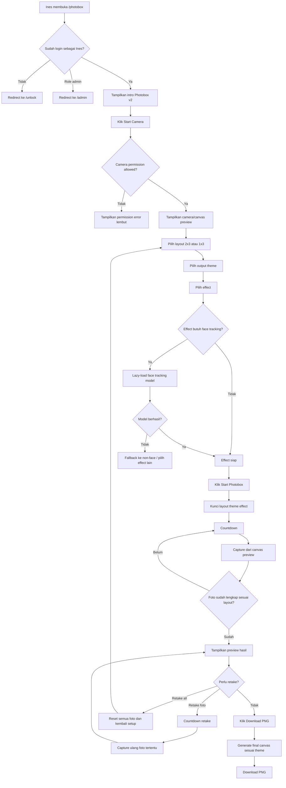
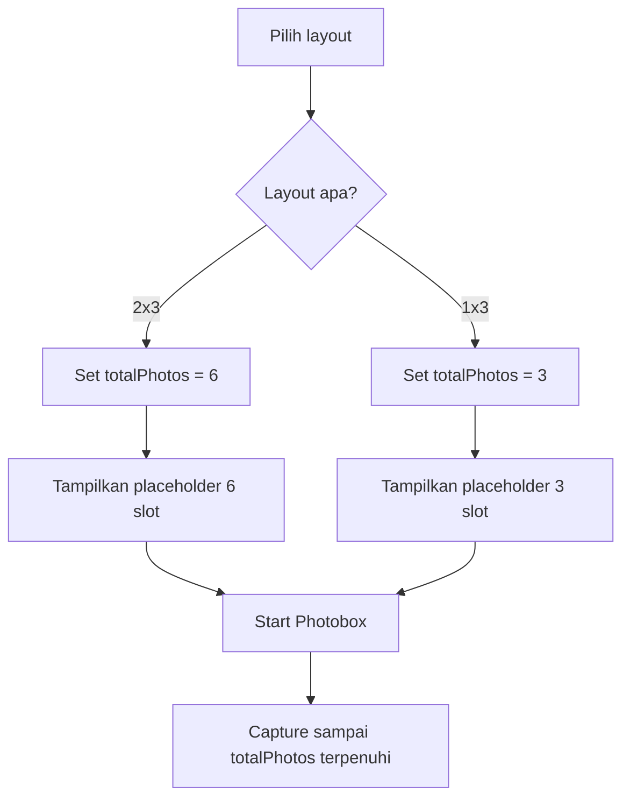
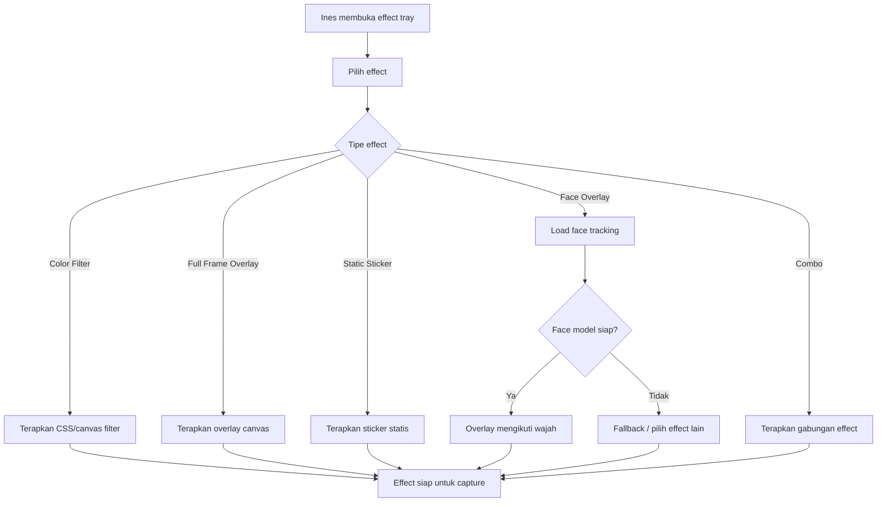
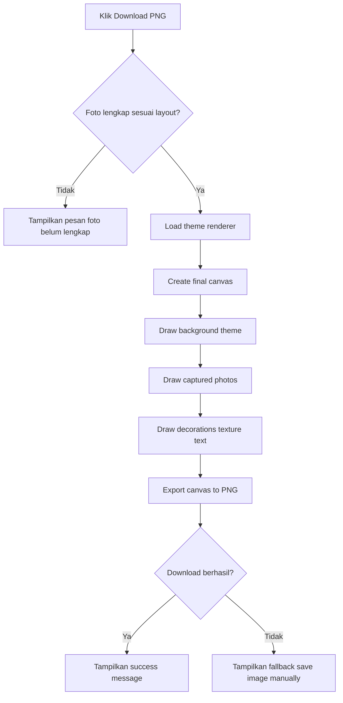

# User Flow Photobox v2 — Advanced Effects & Vintage Output

## 1. Tujuan Dokumen

Dokumen ini menjelaskan alur penggunaan fitur **Photobox v2** dari sudut pandang Ines.

Photobox v2 adalah pengembangan dari Photobox MVP. Pada MVP, Ines sudah bisa membuka `/photobox`, menyalakan kamera, memilih frame dan filter sederhana, mengambil foto otomatis, melakukan retake, lalu mengunduh hasil akhir sebagai PNG. Pada v2, pengalaman ditingkatkan dengan:

1. Pilihan layout hasil akhir **2x3** dan **1x3**.
2. Pilihan **output theme** seperti vintage photobooth, old photo, polaroid, cassette/tape aesthetic, VHS/camcorder, scrapbook page, analog film, dan dusty rose card.
3. **Effect picker 20+ efek** seperti Instagram-style tray.
4. Efek warna, overlay aesthetic, sticker romantis/lucu, dan face tracking effect secara bertahap.
5. Output tetap **download PNG saja**.
6. Tidak ada upload ke Supabase, Gallery, backend, atau server eksternal.

User flow ini dibuat agar Photobox v2 tetap terasa sederhana untuk Ines, walaupun fitur visualnya menjadi lebih kaya.

---

## 2. Actor

```text
Actor utama: Ines
Role: ines
Route: /photobox
```

Admin/Moses tidak memiliki flow khusus untuk menggunakan Photobox v2.

Admin hanya mengelola konten website lain seperti foto, musik, love letter, dan daily message. Photobox v2 tetap menjadi fitur personal untuk Ines.

---

## 3. Prinsip UX Utama

Photobox v2 harus mengikuti prinsip berikut:

```text
1. Kamera tidak menyala otomatis.
2. Ines harus klik Start Camera terlebih dahulu.
3. Layout, theme, dan effect dipilih sebelum capture.
4. Saat capture dimulai, layout, theme, dan effect dikunci.
5. Capture tetap otomatis dengan countdown.
6. Output final hanya download PNG.
7. Tidak ada simpan ke Supabase.
8. Tidak ada share langsung ke WhatsApp/Instagram.
9. Jika face tracking gagal, fitur tetap bisa berjalan dengan efek non-face.
10. Error harus ditulis lembut dan tidak teknis.
11. UI harus nyaman di HP.
12. Efek banyak, tetapi tidak boleh membuat UI terasa ramai.
```

---

## 4. Entry Flow

### 4.1 Masuk dari Navigasi Ines

```text
Ines login dengan kode 230624
↓
Masuk ke /home
↓
Klik menu Photobox
↓
Masuk ke /photobox
↓
Website menampilkan intro Photobox v2
```

### 4.2 Masuk Langsung dari URL

```text
Ines membuka /photobox langsung dari browser
↓
Sistem mengecek session/localStorage
↓
Apakah user sudah unlock?
```

Jika belum login:

```text
Redirect ke /unlock
```

Jika role = `ines`:

```text
Tampilkan halaman Photobox v2
```

Jika role = `admin`:

```text
Redirect ke /admin
```

---

## 5. Main Flow Ringkas

Flow utama Photobox v2:

```text
Buka Photobox
↓
Start Camera
↓
Pilih layout hasil akhir
↓
Pilih output theme
↓
Pilih effect
↓
Start Photobox
↓
Countdown
↓
Capture otomatis
↓
Preview hasil
↓
Retake jika perlu
↓
Generate PNG
↓
Download PNG
```

---

## 6. Main Flow Detail

```text
Ines membuka /photobox
↓
Website menampilkan intro Photobox v2
↓
Website menampilkan pesan privasi singkat
↓
Ines klik Start Camera
↓
Browser meminta izin kamera
↓
Jika izin diberikan, camera preview tampil
↓
Ines memilih layout hasil akhir:
    - 2x3
    - 1x3
↓
Ines memilih output theme:
    - Vintage Photobooth
    - Old Photo Album
    - Polaroid Collage
    - Cassette/Tape Aesthetic
    - VHS/Camcorder
    - Scrapbook Page
    - Analog Film
    - Dusty Rose Card
    - dan theme lain yang tersedia
↓
Ines memilih effect dari effect tray:
    - color filter
    - full-frame overlay
    - static sticker
    - face overlay jika tersedia
↓
Website menampilkan preview effect pada camera/canvas preview
↓
Ines klik Start Photobox
↓
Sistem mengunci layout, theme, dan effect
↓
Sistem menentukan jumlah foto berdasarkan layout:
    - 2x3 = 6 foto
    - 1x3 = 3 foto
↓
Countdown berjalan sebelum setiap foto
↓
Sistem capture foto dari canvas preview
↓
Foto disimpan di capturedPhotos
↓
Proses berulang sampai jumlah foto terpenuhi
↓
Website menampilkan preview hasil
↓
Ines dapat:
    - retake foto tertentu
    - retake all
    - ganti layout/theme/effect dengan mulai ulang
    - download PNG
↓
Jika Ines klik Download PNG
↓
Sistem generate final canvas sesuai layout dan theme
↓
File PNG terdownload ke device Ines
```

---

## 7. Privacy Message Flow

Karena fitur memakai kamera dan efek wajah, Photobox v2 perlu memberi pesan privasi yang lembut.

### 7.1 Tampilan Sebelum Start Camera

```text
Ines membuka Photobox
↓
Website menampilkan intro
↓
Website menampilkan privacy note kecil
```

Contoh copy:

```text
This little camera stays between you and this device.
Your photos are not uploaded anywhere, sayang.
```

Aturan:

```text
- Pesan tidak boleh terasa seperti warning teknis.
- Pesan harus menenangkan.
- Pesan harus menjelaskan bahwa foto tidak diupload.
- Pesan boleh kecil, tetapi mudah dibaca.
```

---

## 8. Camera Permission Flow

### 8.1 Permission Diberikan

```text
Ines klik Start Camera
↓
Browser menampilkan permission dialog
↓
Ines klik Allow
↓
Camera stream aktif
↓
Canvas preview tampil
↓
Website menampilkan pilihan layout, theme, dan effect
```

### 8.2 Permission Ditolak

```text
Ines klik Start Camera
↓
Browser menampilkan permission dialog
↓
Ines klik Block / Deny
↓
Website menampilkan error lembut
↓
Website memberi instruksi untuk allow camera permission
```

Contoh copy:

```text
I need your camera permission to make this little memory.
Please allow camera access, sayang.
```

Action yang tersedia:

```text
- Try Again
- Back to Home
```

### 8.3 Kamera Tidak Tersedia

```text
Ines klik Start Camera
↓
getUserMedia gagal karena device/browser tidak punya kamera
↓
Website menampilkan pesan kamera tidak tersedia
```

Contoh copy:

```text
Your camera is not available right now.
Try again from another device or browser.
```

---

## 9. Layout Selection Flow

Photobox v2 memiliki dua pilihan layout final.

### 9.1 Layout 2x3

```text
Ines memilih layout 2x3
↓
Sistem menandai layout 2x3 sebagai active
↓
Jumlah foto yang dibutuhkan = 6
↓
Preview placeholder menampilkan 6 slot
↓
Saat Start Photobox, sistem capture 6 foto otomatis
↓
Final PNG berbentuk 2 kolom x 3 baris
```

Cocok untuk:

```text
- photobooth klasik
- scrapbook page
- analog film grid
- dusty rose card
```

### 9.2 Layout 1x3

```text
Ines memilih layout 1x3
↓
Sistem menandai layout 1x3 sebagai active
↓
Jumlah foto yang dibutuhkan = 3
↓
Preview placeholder menampilkan 3 slot vertikal
↓
Saat Start Photobox, sistem capture 3 foto otomatis
↓
Final PNG berbentuk vertical photo strip
```

Cocok untuk:

```text
- classic photobooth strip
- vintage strip
- cassette/tape frame
- VHS/camcorder mini strip
```

### 9.3 Aturan Layout Selection

```text
1. Layout dipilih sebelum capture.
2. Layout dikunci selama capture.
3. Jika ingin mengganti layout setelah capture, Ines harus retake all / start over.
4. Layout menentukan jumlah foto yang harus diambil.
5. Download hanya bisa dilakukan jika jumlah foto sesuai layout sudah lengkap.
```

---

## 10. Theme Selection Flow

Theme adalah gaya hasil akhir PNG. Theme berbeda dari effect.

```text
Effect = tampilan foto saat capture
Theme = tampilan keseluruhan file PNG hasil download
```

### 10.1 Flow Memilih Theme

```text
Camera preview sudah aktif
↓
Ines melihat pilihan output theme
↓
Ines memilih salah satu theme
↓
Theme aktif ditandai dengan soft active state
↓
Preview kecil hasil akhir menyesuaikan theme
↓
Theme digunakan saat generate PNG
```

### 10.2 Theme Awal yang Disarankan

```text
1. Vintage Photobooth
2. Old Photo Album
3. Polaroid Collage
4. Cassette/Tape Aesthetic
5. VHS/Camcorder
6. Scrapbook Page
7. Analog Film
8. Dusty Rose Card
```

### 10.3 Aturan Theme

```text
1. Theme dipilih sebelum capture.
2. Theme dikunci selama capture.
3. Theme boleh diganti sebelum Start Photobox.
4. Setelah foto selesai, theme tidak diganti langsung pada hasil yang sama.
5. Jika ingin theme lain, Ines dapat Retake All / Start Over.
```

Catatan:

```text
Aturan ini menjaga flow tetap sederhana dan menghindari editing kompleks setelah capture.
```

---

## 11. Effect Selection Flow

Effect adalah efek yang diterapkan pada preview camera dan foto hasil capture.

### 11.1 Flow Memilih Effect

```text
Camera preview sudah aktif
↓
Ines melihat effect tray seperti Instagram
↓
Ines scroll horizontal daftar effect
↓
Ines memilih salah satu effect
↓
Effect aktif ditandai dengan animasi lembut
↓
Camera preview menampilkan effect aktif
↓
Ines dapat mencoba effect lain sebelum capture
↓
Saat Start Photobox diklik, effect dikunci
```

### 11.2 Kategori Effect

Effect dibagi menjadi beberapa kategori:

```text
1. Color Filter
2. Full-Frame Overlay
3. Static Sticker
4. Face Overlay
5. Combo Effect
```

### 11.3 Color Filter Flow

```text
Ines memilih color filter
↓
Preview kamera berubah warna
↓
Face tracking tidak perlu aktif
↓
Capture menyimpan foto dengan filter tersebut
```

Contoh:

```text
- Warm Film
- Soft Pink
- Old Photo
- Black & White
- Analog Fade
- Dreamy Cream
```

### 11.4 Full-Frame Overlay Flow

```text
Ines memilih full-frame overlay
↓
Preview menampilkan overlay seperti light leak, dust, grain, VHS lines
↓
Face tracking tidak perlu aktif
↓
Capture menyimpan foto dengan overlay tersebut
```

Contoh:

```text
- Film Grain
- Light Leak
- Dust & Scratch
- VHS Lines
- Soft Glow
```

### 11.5 Static Sticker Flow

```text
Ines memilih static sticker effect
↓
Preview menampilkan sticker/dekorasi statis
↓
Sticker tidak mengikuti wajah
↓
Capture menyimpan foto dengan sticker tersebut
```

Contoh:

```text
- Floating Hearts
- Sparkles
- For Ines Label
- Doodle Hearts
- Scrapbook Stamp
```

### 11.6 Face Overlay Flow

```text
Ines memilih face overlay effect
↓
Sistem mengecek apakah effect membutuhkan face tracking
↓
Jika ya, sistem lazy-load face tracking model
↓
Jika model berhasil dimuat, overlay mengikuti wajah
↓
Jika wajah terdeteksi, effect tampil di posisi wajah
↓
Jika wajah tidak terdeteksi, tampil fallback lembut
↓
Capture menyimpan foto dari canvas preview
```

Contoh:

```text
- Dog Ears
- Cat Ears
- Bunny Ears
- Crown
- Glasses
- Blush
- Heart Cheek
- Hat
```

### 11.7 Combo Effect Flow

```text
Ines memilih combo effect
↓
Sistem menerapkan color filter + overlay/sticker
↓
Jika combo membutuhkan face tracking, model diload
↓
Preview menampilkan gabungan efek
↓
Capture menyimpan hasil gabungan
```

Contoh:

```text
- Puppy Love: dog ears + blush + soft pink
- Birthday Princess: crown + sparkle + warm glow
- VHS Date Night: VHS color + timestamp + scanline
- Vintage Love: sepia + dust + paper border
```

---

## 12. Face Tracking Loading Flow

Face tracking hanya diload jika effect membutuhkan wajah.

```text
Ines memilih effect face overlay
↓
Sistem menampilkan loading kecil:
"Preparing this effect..."
↓
Sistem memuat face tracking model
↓
Apakah model berhasil dimuat?
```

Jika berhasil:

```text
Effect aktif
↓
Overlay mengikuti wajah
```

Jika gagal:

```text
Website menampilkan pesan fallback
↓
Effect tetap aktif dalam mode non-face jika tersedia
atau user diminta memilih effect lain
```

Contoh copy fallback:

```text
This effect is feeling shy on this device.
You can try another one, sayang.
```

Aturan:

```text
1. Gagal face tracking tidak boleh membuat Photobox crash.
2. Start Photobox tetap bisa dilakukan dengan effect non-face.
3. Jika face effect tidak siap, tombol Start Photobox boleh disabled sementara.
4. Jika loading terlalu lama, user bisa cancel dan pilih effect lain.
```

---

## 13. Start Photobox Flow

```text
Ines sudah menyalakan kamera
↓
Ines sudah memilih layout
↓
Ines sudah memilih theme
↓
Ines sudah memilih effect
↓
Ines klik Start Photobox
↓
Sistem validasi:
    - camera aktif?
    - layout tersedia?
    - theme tersedia?
    - effect siap?
↓
Jika valid, sistem mengunci pilihan
↓
Sistem menentukan total photo count:
    - layout 2x3 = 6 foto
    - layout 1x3 = 3 foto
↓
Capture otomatis dimulai
```

Saat capture berjalan:

```text
- Layout picker disabled
- Theme picker disabled
- Effect picker disabled
- Start Camera disabled
- Start Photobox disabled
- Retake belum tampil
- Countdown tampil jelas
```

---

## 14. Auto Capture Flow

### 14.1 Auto Capture untuk Layout 2x3

```text
Layout aktif = 2x3
↓
Total foto = 6
↓
Countdown foto 1
↓
Capture foto 1
↓
Countdown foto 2
↓
Capture foto 2
↓
Countdown foto 3
↓
Capture foto 3
↓
Countdown foto 4
↓
Capture foto 4
↓
Countdown foto 5
↓
Capture foto 5
↓
Countdown foto 6
↓
Capture foto 6
↓
Preview 6 foto tampil
```

### 14.2 Auto Capture untuk Layout 1x3

```text
Layout aktif = 1x3
↓
Total foto = 3
↓
Countdown foto 1
↓
Capture foto 1
↓
Countdown foto 2
↓
Capture foto 2
↓
Countdown foto 3
↓
Capture foto 3
↓
Preview 3 foto tampil
```

### 14.3 Countdown Copy

```text
5
4
3
2
1
Smile, sayang!
```

Opsional variasi copy:

```text
Hold that smile, Nes.
One more, sayang.
Tiny memory incoming.
```

---

## 15. Capture Result Data Flow

Setiap hasil capture disimpan sementara di browser memory.

Format data konseptual:

```js
{
  id: "photo-1",
  index: 0,
  dataUrl: "data:image/png;base64,...",
  capturedAt: "2026-07-08T...",
  layoutId: "two-by-three",
  themeId: "vintage-photobooth",
  effectId: "warm-film"
}
```

Aturan:

```text
1. Data hanya disimpan sementara selama sesi halaman.
2. Data tidak dikirim ke Supabase.
3. Data tidak dikirim ke backend.
4. Data hilang jika user refresh atau keluar halaman.
5. Data hanya dipakai untuk preview dan generate PNG final.
```

---

## 16. Preview Flow

### 16.1 Preview Setelah Capture Selesai

```text
Capture selesai
↓
Website menampilkan hasil foto sesuai layout aktif
```

Jika layout 2x3:

```text
Preview menampilkan 6 foto dalam grid 2 kolom x 3 baris
```

Jika layout 1x3:

```text
Preview menampilkan 3 foto dalam strip vertikal 1 kolom x 3 baris
```

### 16.2 Action di Preview

Ines dapat memilih:

```text
1. Retake foto tertentu
2. Retake All
3. Download PNG
4. Back to settings / Start Over
```

Aturan preview:

```text
1. Preview harus memperlihatkan foto yang sudah memiliki effect.
2. Preview tidak harus 100% sama dengan final theme PNG, tetapi harus cukup mewakili.
3. Tombol Download hanya aktif jika jumlah foto lengkap sesuai layout.
4. Tombol Retake mudah ditemukan di setiap foto.
```

---

## 17. Retake Foto Tertentu Flow

```text
Ines melihat preview hasil capture
↓
Ines klik Retake pada salah satu foto
↓
Sistem menyimpan retakeIndex
↓
Sistem memastikan kamera masih aktif
↓
Jika kamera mati, sistem menyalakan ulang kamera setelah user klik izin jika diperlukan
↓
Countdown 5 detik
↓
Capture ulang satu foto
↓
Foto lama diganti dengan foto baru
↓
Preview diperbarui
```

Aturan:

```text
1. Retake menggunakan layout, theme, dan effect yang sama dengan sesi capture.
2. Ines tidak bisa mengganti effect hanya untuk satu foto.
3. Retake tidak mengubah jumlah foto.
4. Setelah retake selesai, Download PNG tetap bisa dilakukan.
```

---

## 18. Retake All / Start Over Flow

```text
Ines klik Retake All / Start Over
↓
Website meminta konfirmasi lembut
↓
Jika batal:
    tetap di preview
↓
Jika lanjut:
    hapus semua capturedPhotos
    reset finalImageUrl
    kembali ke mode camera/setup
↓
Ines boleh memilih ulang layout, theme, dan effect
↓
Ines bisa Start Photobox lagi
```

Contoh confirmation copy:

```text
Do you want to take these tiny memories again, sayang?
```

Action:

```text
- Keep them
- Retake All
```

---

## 19. Download PNG Flow

```text
Ines melihat preview foto lengkap
↓
Ines klik Download PNG
↓
Sistem validasi:
    - jumlah foto sesuai layout?
    - theme tersedia?
    - canvas final bisa dibuat?
↓
Jika valid:
    sistem generate final canvas
↓
Final canvas menggambar:
    - background theme
    - foto hasil capture
    - theme decorations
    - texture/grain/light leak jika ada
    - text "Photobox" / "For Ines"
    - tanggal otomatis
    - teks kecil "230624" atau "our little place"
↓
Canvas diekspor menjadi PNG
↓
Browser mendownload file
↓
Website menampilkan success message
```

Filename:

```text
ines-photobox-YYYY-MM-DD.png
```

Contoh success copy:

```text
Your little photobox is ready, sayang.
```

---

## 20. Download Error Flow

### 20.1 Foto Belum Lengkap

```text
Ines klik Download PNG
↓
Sistem mengecek capturedPhotos.length
↓
Jumlah foto belum sesuai layout
↓
Download ditolak
↓
Tampilkan pesan lembut
```

Copy:

```text
Take all tiny memories first, sayang.
```

### 20.2 Generate PNG Gagal

```text
Ines klik Download PNG
↓
Canvas generation gagal
↓
Website menampilkan error lembut
↓
User bisa mencoba ulang
```

Copy:

```text
I couldn't save this little memory yet.
Try again, sayang.
```

### 20.3 Download Tidak Berjalan di Browser Tertentu

```text
PNG berhasil dibuat
↓
Browser gagal auto-download
↓
Website menampilkan fallback preview image
↓
User bisa long-press / save image manually
```

Copy:

```text
If the download does not start, hold the image and save it manually, sayang.
```

---

## 21. Ganti Effect Setelah Capture Flow

Keputusan produk:

```text
Effect hanya dipilih sebelum capture.
```

Jika Ines ingin mengganti effect setelah hasil capture selesai:

```text
Ines melihat preview
↓
Ines memilih tombol Start Over / Retake All
↓
Captured photos dihapus
↓
Ines kembali ke mode setup
↓
Ines memilih effect baru
↓
Ines capture ulang
```

Alasan:

```text
1. Flow tetap sederhana.
2. Tidak perlu editing kompleks setelah capture.
3. Hasil lebih konsisten.
4. Mengurangi risiko memory berat di HP.
```

---

## 22. Face Not Detected Flow

Flow ini hanya berlaku untuk effect yang membutuhkan face tracking.

```text
Ines memilih face overlay effect
↓
Camera preview aktif
↓
Sistem mencoba mendeteksi wajah
↓
Apakah wajah terdeteksi?
```

Jika wajah terdeteksi:

```text
Overlay ditempel pada titik wajah
↓
Preview effect tampil normal
```

Jika wajah tidak terdeteksi:

```text
Website tetap menampilkan video preview
↓
Overlay face tidak ditampilkan sementara
↓
Tampilkan hint kecil
```

Contoh copy:

```text
Move your face a little closer, sayang.
```

Aturan:

```text
1. Tidak boleh menampilkan error besar.
2. Tidak boleh menghentikan kamera.
3. Tidak boleh membuat user panik.
4. Jika user tetap capture, foto boleh tersimpan tanpa face overlay.
```

---

## 23. Performance Fallback Flow

Jika device lambat atau face tracking terlalu berat:

```text
Sistem mendeteksi FPS rendah / model terlalu lama load
↓
Website menampilkan fallback lembut
↓
Face tracking dihentikan
↓
User diarahkan memakai effect non-face
```

Copy:

```text
This effect is a little heavy for this device.
Let's use a softer one, sayang.
```

Aturan:

```text
1. Jangan crash.
2. Jangan freeze terlalu lama.
3. Kamera harus tetap bisa dipakai.
4. Effect non-face tetap tersedia.
5. User tetap bisa menyelesaikan Photobox.
```

---

## 24. Exit Flow

```text
Ines meninggalkan halaman /photobox
↓
Component unmount
↓
Sistem menghentikan camera stream
↓
Sistem menghentikan requestAnimationFrame
↓
Sistem membersihkan countdown interval
↓
Jika face model aktif, sistem menutup/cleanup model
↓
Kamera device mati
```

Aturan:

```text
1. Kamera tidak boleh tetap aktif setelah keluar halaman.
2. Tidak boleh ada memory leak.
3. Tidak boleh ada countdown yang terus berjalan.
4. Tidak boleh ada animation loop yang tetap hidup.
```

---

## 25. Mobile Flow

Karena kemungkinan besar Ines membuka website dari HP, mobile flow harus menjadi prioritas.

### 25.1 Mobile Layout Flow

```text
Ines membuka /photobox di HP
↓
Intro tampil vertical
↓
Start Camera button besar
↓
Camera preview tampil full width
↓
Layout picker tampil sebagai card kecil/horizontal selector
↓
Theme picker tampil horizontal scroll
↓
Effect tray tampil di bawah preview seperti Instagram
↓
Start Photobox button fixed/terlihat jelas
↓
Countdown tampil besar di atas preview
↓
Preview hasil tampil sesuai layout
↓
Download button besar tampil di bawah preview
```

### 25.2 Mobile Interaction Rules

```text
1. Tombol harus mudah disentuh.
2. Effect tray tidak boleh terlalu tinggi.
3. Theme picker tidak boleh menutupi camera preview.
4. Saat countdown, UI lain boleh disembunyikan agar fokus.
5. Preview 1x3 harus nyaman dilihat di layar kecil.
6. Preview 2x3 harus tetap terbaca, tetapi boleh lebih kecil.
7. Download button harus mudah ditemukan.
```

---

## 26. Desktop Flow

```text
Ines membuka /photobox di laptop
↓
Halaman bisa memakai dua kolom:
    - kiri: camera preview / result preview
    - kanan: layout, theme, effect, controls
↓
Effect tray tetap horizontal
↓
Preview final bisa tampil lebih besar
↓
Download button tampil jelas
```

Aturan:

```text
Desktop boleh lebih luas, tetapi jangan menjadi dashboard.
```

---

## 27. Empty / Initial State

Saat Ines baru membuka Photobox dan belum menyalakan kamera:

```text
Tampilkan intro card
Tampilkan privacy note
Tampilkan Start Camera button
Tampilkan sample preview kecil theme/effect jika diperlukan
```

Contoh copy:

```text
Take a few tiny memories, sayang.
Pick a mood for the camera, smile a little,
and let this place keep one more piece of you.
```

---

## 28. State yang Dibutuhkan

State utama di Photobox v2:

```js
selectedLayout
selectedTheme
selectedEffect
capturedPhotos
isCameraActive
isCapturing
countdown
currentCaptureIndex
retakeIndex
finalImageUrl
isGenerating
uiError
isFaceModelLoading
isFaceModelReady
faceTrackingError
isPerformanceFallback
```

State turunan:

```js
totalPhotos = selectedLayout.photoCount
canStartCapture = isCameraActive && selectedLayout && selectedTheme && selectedEffect && !isCapturing
canDownload = capturedPhotos.length === totalPhotos && !isCapturing
needsFaceTracking = selectedEffect.requiresFaceTracking === true
```

---

## 29. Data yang Tidak Disimpan

Photobox v2 tidak menyimpan data berikut ke server:

```text
1. Foto hasil capture
2. Final PNG
3. Face landmarks
4. Camera stream
5. Data wajah
6. Riwayat Photobox
```

Semua data hanya hidup di browser selama sesi halaman.

---

## 30. Mermaid Diagram — Main Flow Photobox v2



---

## 31. Mermaid Diagram — Layout Decision Flow



---

## 32. Mermaid Diagram — Effect Selection Flow



---

## 33. Mermaid Diagram — Download Flow



---

## 34. Acceptance Criteria User Flow

Photobox v2 dianggap sesuai user flow jika:

1. Ines bisa membuka `/photobox` hanya setelah login sebagai role `ines`.
2. Admin tidak bisa menggunakan `/photobox` dan diarahkan ke `/admin`.
3. Kamera tidak menyala otomatis.
4. Kamera hanya menyala setelah klik Start Camera.
5. Privacy note tampil sebelum atau di sekitar Start Camera.
6. Ines bisa memilih layout `2x3` atau `1x3`.
7. Layout `2x3` menghasilkan 6 foto.
8. Layout `1x3` menghasilkan 3 foto.
9. Ines bisa memilih output theme sebelum capture.
10. Ines bisa memilih effect sebelum capture.
11. Effect picker mendukung 20+ efek secara konseptual.
12. Layout, theme, dan effect dikunci selama capture.
13. Countdown tampil sebelum setiap foto.
14. Capture otomatis berjalan sampai jumlah foto sesuai layout terpenuhi.
15. Preview hasil tampil sesuai layout.
16. Ines bisa retake foto tertentu.
17. Ines bisa retake all/start over.
18. Ines bisa download hasil akhir PNG.
19. Download tidak mengupload foto ke Supabase/backend.
20. Jika face tracking gagal, flow tetap bisa selesai.
21. Jika permission kamera ditolak, tampil error lembut.
22. Kamera berhenti saat halaman ditinggalkan.
23. User flow nyaman di HP.
24. Error tidak menggunakan bahasa teknis yang membingungkan Ines.

---

## 35. Catatan Non-Scope Flow

Hal berikut tidak masuk flow Photobox v2 saat ini:

```text
1. Simpan hasil PNG ke Supabase.
2. Upload otomatis ke Gallery.
3. Admin melihat hasil Photobox.
4. Share langsung ke WhatsApp/Instagram.
5. Editing manual setelah capture.
6. Drag sticker manual setelah foto jadi.
7. Crop manual setelah capture.
8. Video recording.
9. PDF output.
10. Login atau integrasi akun developer Instagram/Snapchat/TikTok.
```

---

## 36. Ringkasan Flow Final

Flow final Photobox v2 tetap sederhana:

```text
Buka Photobox
↓
Start Camera
↓
Pilih layout
↓
Pilih theme
↓
Pilih effect
↓
Start Photobox
↓
Ambil foto otomatis
↓
Preview
↓
Retake jika perlu
↓
Download PNG
```

Walaupun fitur teknis di belakangnya lebih kompleks, pengalaman untuk Ines harus tetap terasa seperti:

```text
Pick a style, smile a little, and keep the memory.
```